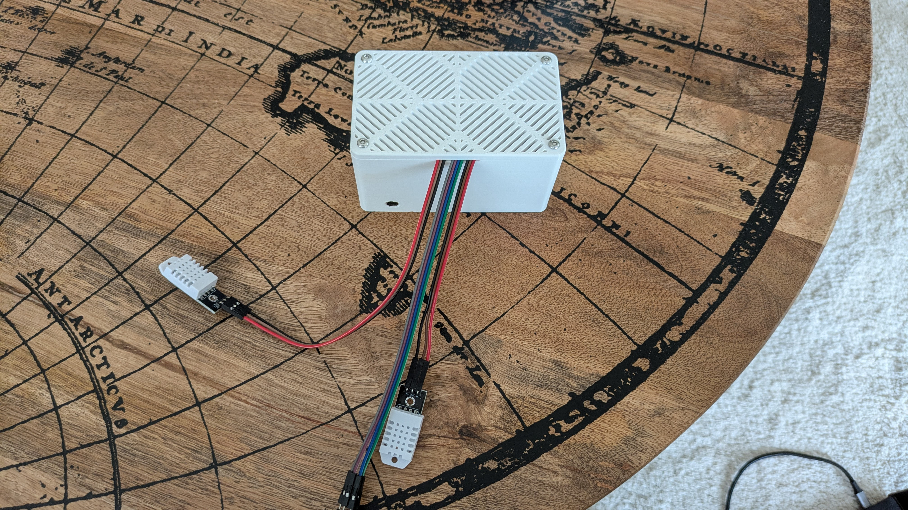
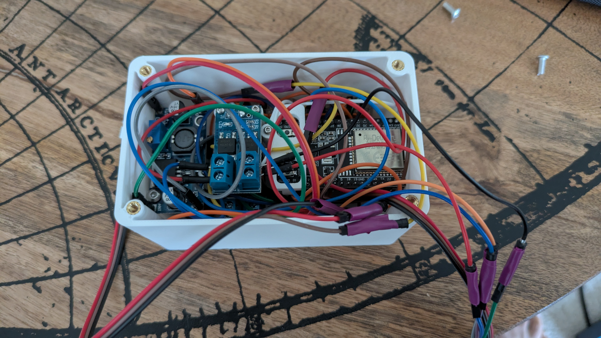
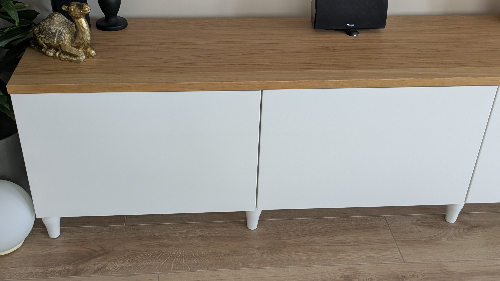
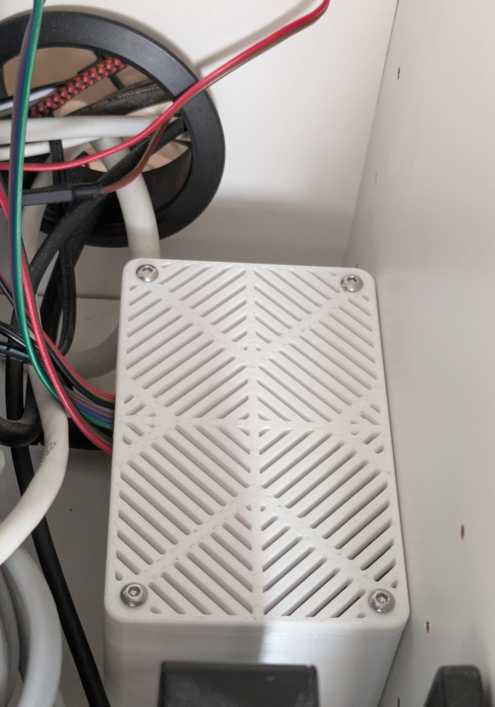
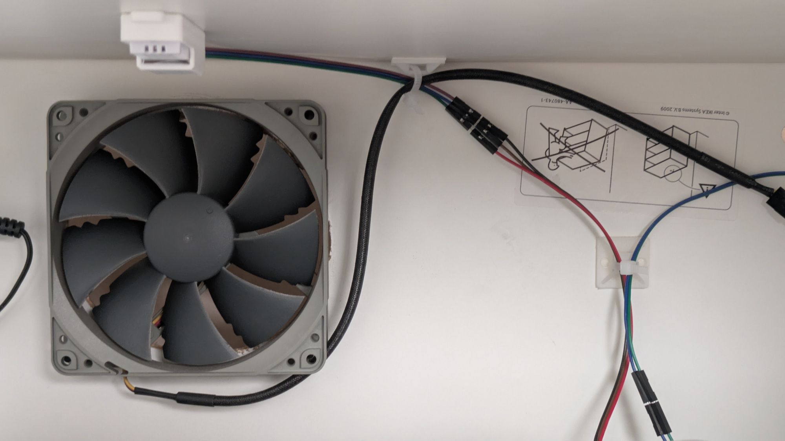
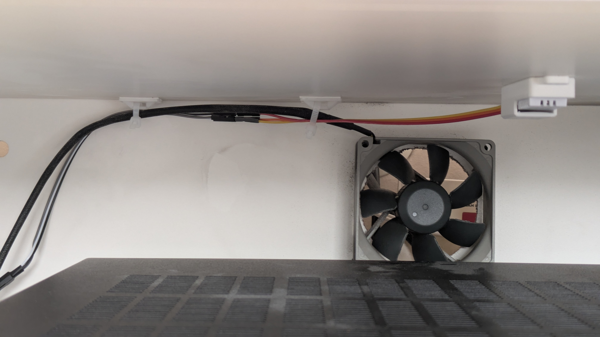
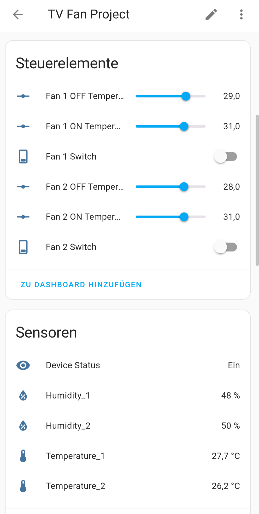
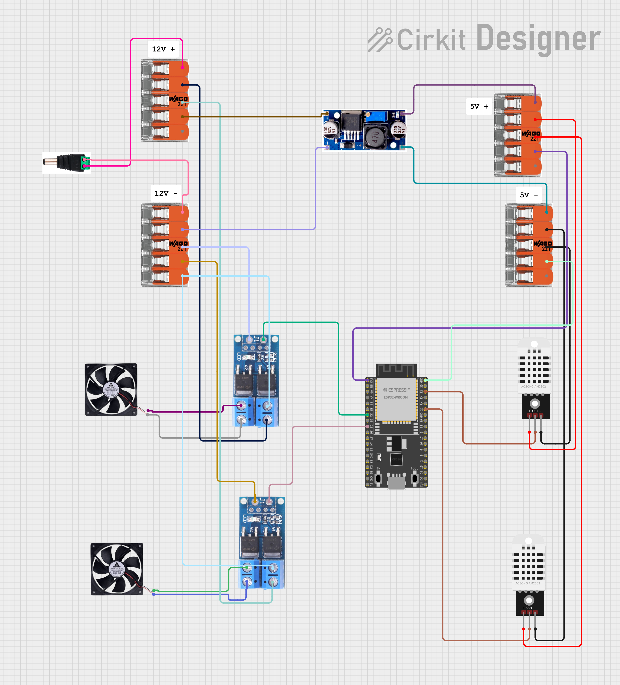

# ESPHome TV Fan Project

This project demonstrates how to build a thermostat-controlled fan system for cooling gaming consoles, media players, or other hardware housed in enclosed cabinets. It includes a custom 3D-printed case that perfectly accommodates all components.

The system controls 2 fans independently based on temperature readings from 2 separate DHT22 sensors, and can easily be extended to support additional fans and sensors.

This solution integrates natively with Home Assistant via ESPHome while also operating autonomously, controlling fans based on cabinet temperature without external dependencies.

# Motivation

I wanted to create a clean TV/media setup in our living room with minimal visible devices on or around the TV cabinet. However, running hardware in closed cabinets without proper cooling leads to overheating issues, so I needed an effective cooling solution. I had previously built a similar system using an Arduino Uno three years ago, but it was no longer functioning reliably and lacked Home Assistant integration.

This project draws inspiration from the excellent work of [patrickcollins12 on GitHub](https://github.com/patrickcollins12/esphome-fan-controller). I developed my own version for several specific reasons:

* I only had 3-pin fans from a previous setup (no PWM control available)
* I wanted a transistor-controlled switching solution for reliable fan operation (PWM signals aren't always dependable for complete fan shutdown)
* My PlayStation 5 generates significant heat quickly, requiring fans to run at 100% capacity. Since I use ultra-quiet Noctua fans, speed reduction isn't necessary from a noise perspective. 

## Visuals
*(Additional images are available in the /img folder)*

## Hardware Components

* ESP32 Development Board (Used: ESP32 V4 with CP2102, AZDelivery)
* 2× DC 5V-36V 400W FET Trigger Switch Boards
* 1× LM2596s Step-Down Voltage Regulator (24V/12V/5V/3V Buck Converter)
* 2x DHT22 Temperature/Humidity Sensors
* 2× 12V PC Fans (2-pin configuration)
* 12V 1-2A Power Supply
* 12V Male-to-Female Power Adapter
* Jumper cables
* 4× WAGO 221-415, COMPACT Splicing Connector, 5-pole (Optional, but fit well into the 3D-printed case) 

## Wiring & Pin Assignments

### GPIO Pin Usage
| GPIO Pin | Component | Description |
|----------|-----------|-------------|
| GPIO22   | DHT22 #1  | Temperature/Humidity Sensor 1 |
| GPIO21   | DHT22 #2  | Temperature/Humidity Sensor 2 |
| GPIO32   | FET Board #1 | Fan 1 Control Signal |
| GPIO25   | FET Board #2 | Fan 2 Control Signal |

### Wiring Diagrams
- **[Complete Wiring Guide](docs/wiring_diagrams.md)** - Detailed connection tables, safety notes, and troubleshooting
- **[Visual Schematic](docs/detailed_schematic.txt)** - ASCII art diagram showing component connections
- **[Cable Assignments](img/cable_assignments.png)** - Physical cable reference

### Key Connections
- **Power**: 12V supply → LM2596s (configured to 3.3V) → ESP32 VIN
- **Sensors**: DHT22 data pins connected to GPIO22/21, powered by ESP32 3.3V
- **Fan Control**: GPIO32/25 → FET board signal pins
- **Ground**: Common ground connection for all components

## Features

- **Independent Control**: Each fan operates based on its dedicated temperature sensor
- **Configurable Thresholds**: Customize ON/OFF temperatures through Home Assistant
- **Hysteresis Control**: Prevents rapid fan cycling for stable operation
- **Web Interface**: Built-in web server for monitoring and control
- **Home Assistant Integration**: Full API integration with encryption support

## 3D Printed Case Hardware

* 5× Ruthex M3 Threaded Inserts
* 5× M3 Screws
* 7× Ruthex M2 Threaded Inserts  
* 7× M2 Screws

## Assembly Guidelines

* **Voltage Regulation**: The buck converter must be precisely adjusted to 3.3V to prevent damage to the ESP32 and connected modules. Connect 12V to the input pins, attach a multimeter (set to voltage mode) to the output pins, and carefully adjust the potentiometer with a screwdriver until the multimeter reads exactly 3.3V.

* **Compact Design**: The 3D case is designed for minimal size, which limits assembly flexibility. When soldering pins to components, ensure one of the FET boards has pins soldered "upside down" - otherwise, the case won't close properly. Refer to the images in the img folder if uncertain about component orientation. On the other hand, you avoid these issues if you use flexible soldering cables instead of jumper cables.

* **Safety Precautions**: Prevent bare 12V and 3.3V wire ends from touching each other, as this can cause immediate component failure. Use heat shrink tubing or electrical tape to insulate exposed connections, especially where jumper cables might accidentally contact each other and create short circuits. 

## License

This project is published under [CC BY-NC-SA 4.0](https://creativecommons.org/licenses/by-nc-sa/4.0/).
